Задание 1
Повторить демонстрацию лекции(развернуть vpc, 2 веб сервера, бастион сервер)
  - Создала сервисный аккаунт в облаке. Выдала права editor

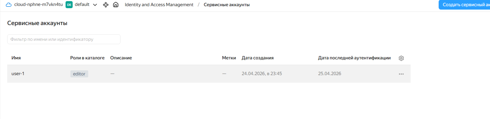
>Сервисный аккаунт

  - Выпустила авторизованный ключ для этого аккаунта и скачала его по пути ~/.authorized_key.json .
  - Вписала в переменные cloud_id и folder_id в variables.tf
  - Изменила ssh-ключ в файле cloud-init.yml (ssh-keygen -t ed25519). cp terraformrc ~/.terraformrc
  - terraform init && terraform apply

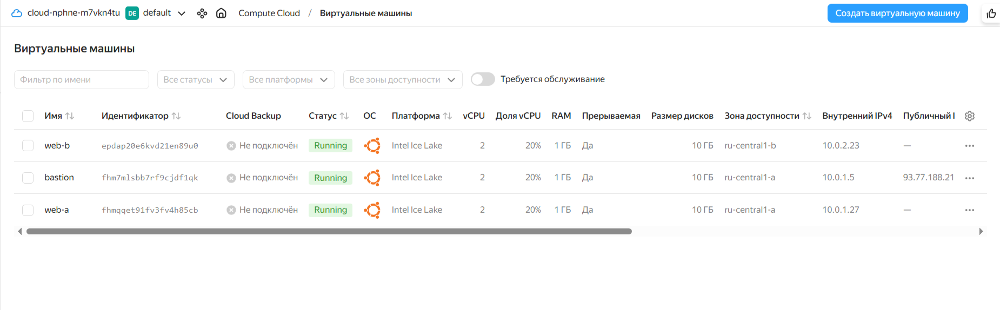
>Запущенные ВМ 

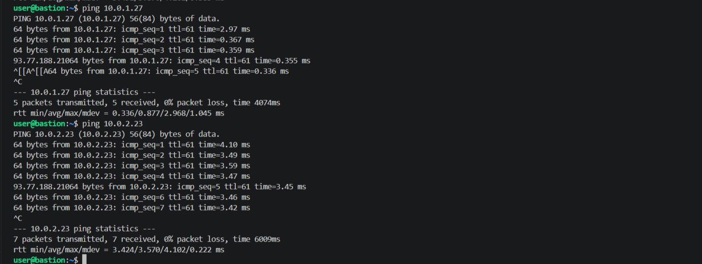
>Проверка связи между бастионом и ВМ
  
  - rm ~/.ssh/known_hosts. Выполнить playbook ANSIBLE_HOST_KEY_CHECKING=False ansible-playbook -i ./hosts.ini test.yml

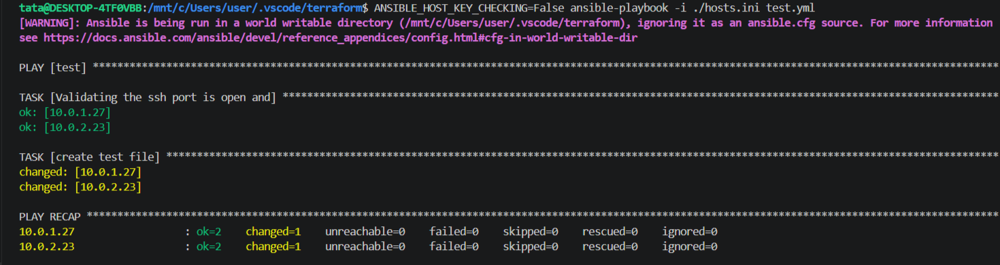
>Запуск плейбука

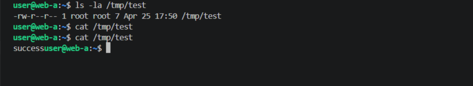
>Созданный файл на web-a

Задание 2
С помощью ansible подключиться к web-a и web-b , установить на них nginx.(написать нужный ansible playbook)

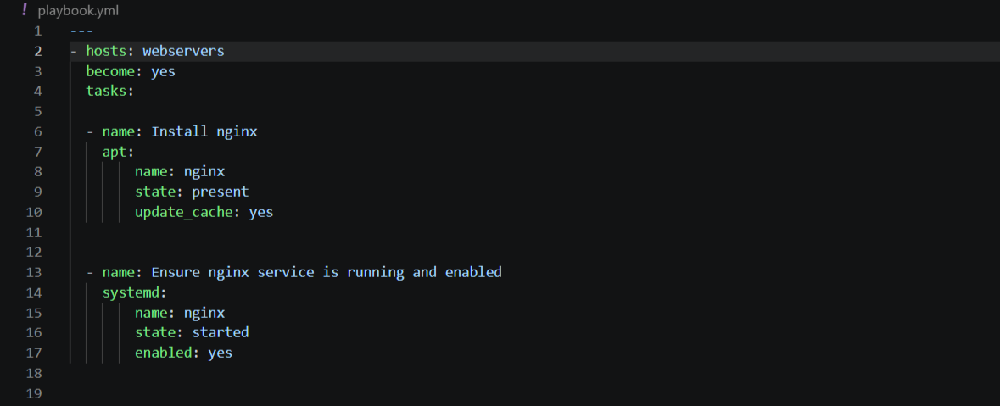
>Плейбук

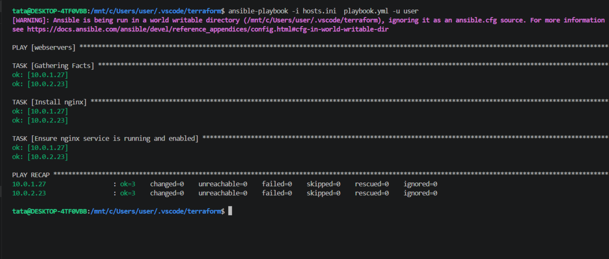
>Запуск плейбука

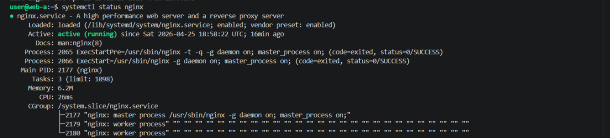
>Запущенный nginx на web-a

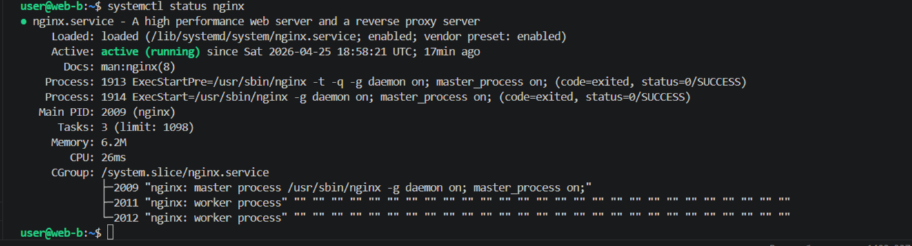
>Запущенный nginx на web-b

Задание 3*
Выполните действия, приложите скриншот скриптов, скриншот выполненного проекта.

Добавить еще одну виртуальную машину.

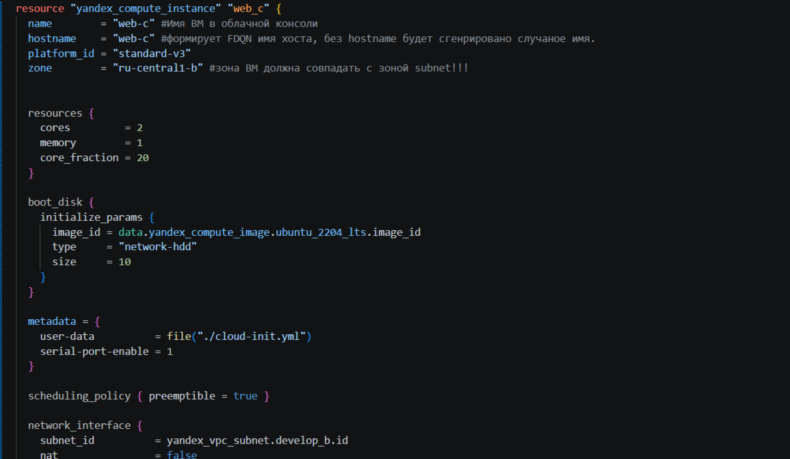
>Добавление ВМ в vms.tf

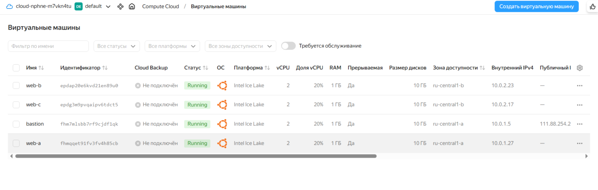
>Запущенная машина web-c

>Добавление в плейбук установку БД

Установить на нее любую базу данных.
Выполнить проверку состояния запущенных служб через Ansible.

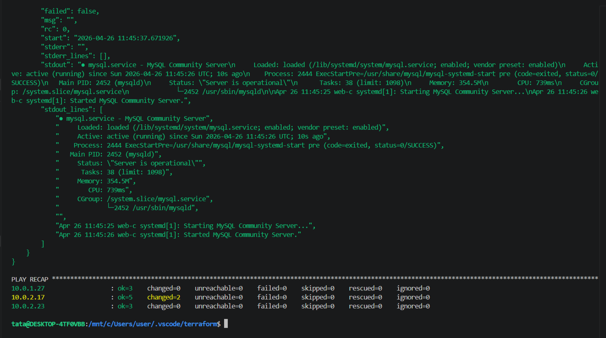
>Запуск плейбука и статус БД

Задание 4*
Изучите инструкцию yandex для terraform. Добейтесь работы паплайна с безопасной передачей токена от облака в terraform через переменные окружения. Для этого:

Настройте профиль для yc tools по инструкции.
Удалите из кода строчку "token = var.yandex_cloud_token". Terraform будет считывать значение ENV переменной YC_TOKEN.
  - Так как этой строки и не было, я закоментировала строку `service_account_key_file = file(".authorized_key.json")`
  
Выполните команду export YC_TOKEN=$(yc iam create-token) и в том же shell запустите terraform.

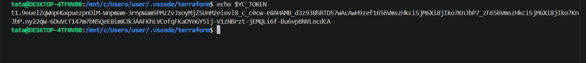
>Сохраненный в переменную токен

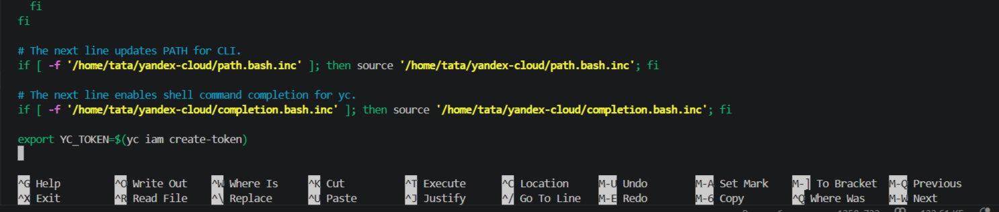
>Добавление в bashrc

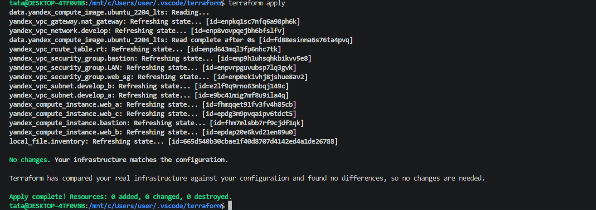
>Работающий terraform